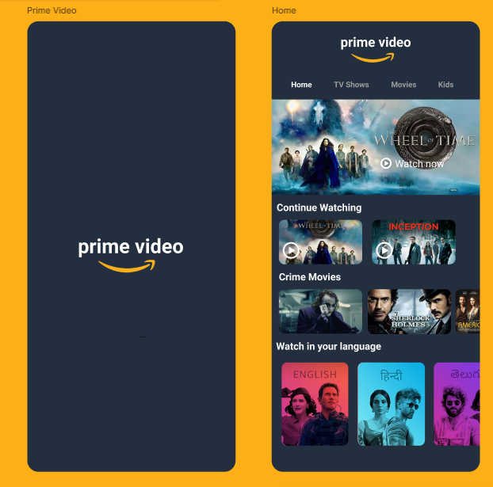
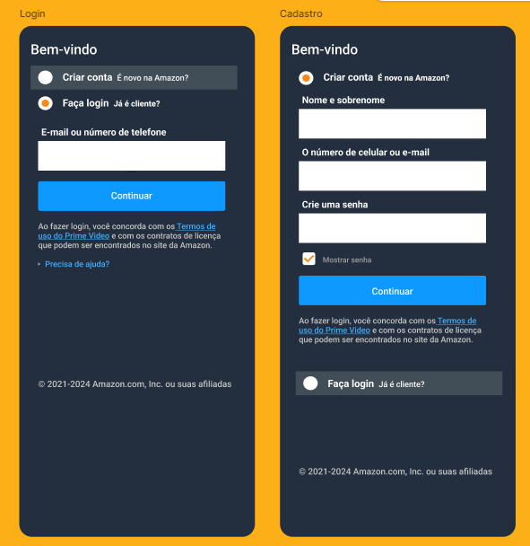

# Telas de referência:

### Obs: Não usei a versão atualizada do expo, pode ocorrer problema de compatibilidade
##

### - Botões expandem e recolhem no login / cadastro
### - Scrolls na tela home
### - Rota na tela login / cadastro para a home